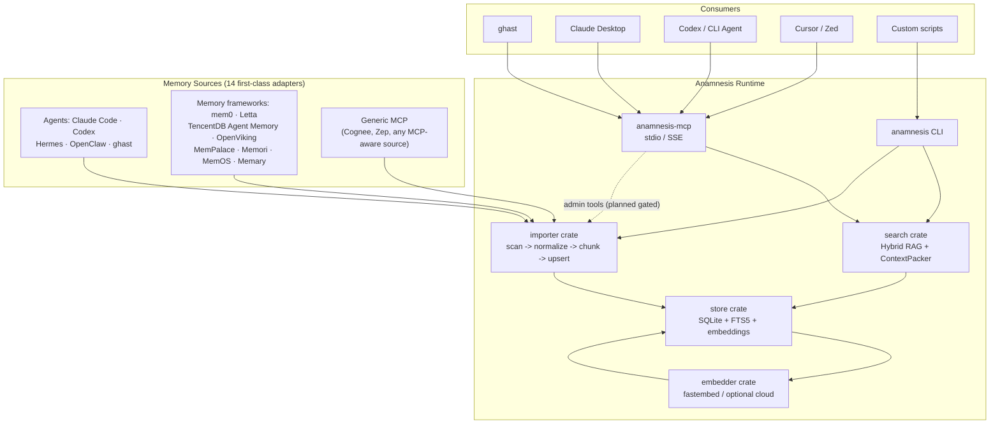
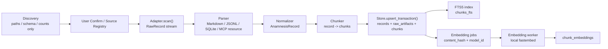
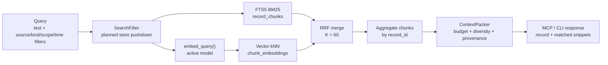
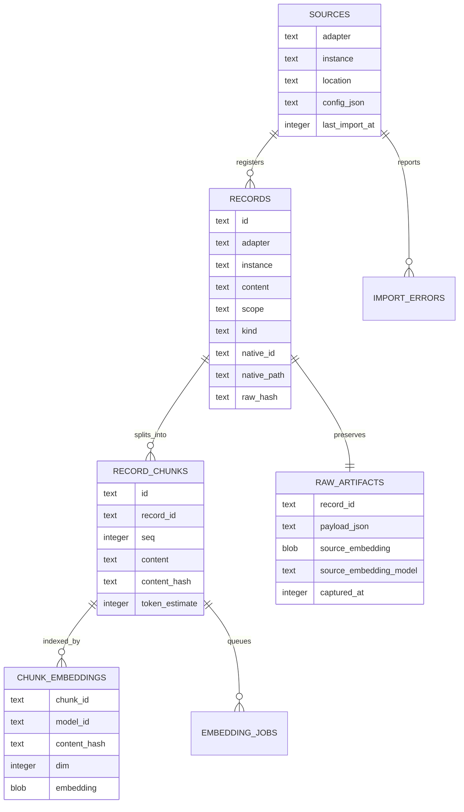
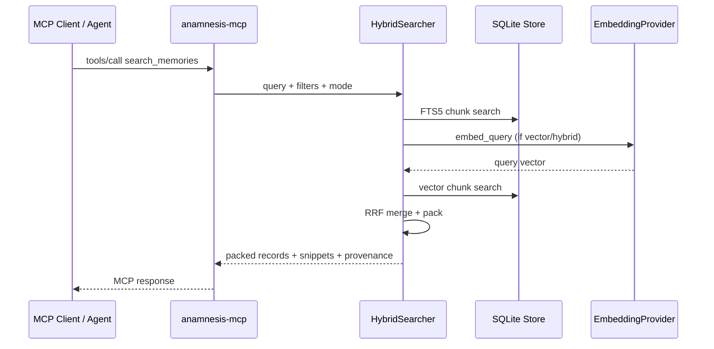

<p align="center">
  
</p>

<h1 align="center">Anamnesis</h1>

<p align="center">
  <strong>A local-first memory layer that imports, normalizes, indexes, and serves agent memory across tools.</strong>
</p>

<p align="center">
  <a href="https://github.com/Trapezohe/Anamnesis"></a>
  <a href="./LICENSE"></a>
  
  
  
  <a href="https://x.com/Ghast_AI"></a>
  <a href="https://discord.gg/ghastai"></a>
</p>

<p align="center">
  <a href="#overview">Overview</a>
  · <a href="#supported-sources--agents">Supported Sources</a>
  · <a href="#architecture">Architecture</a>
  · <a href="#quick-start">Quick Start</a>
  · <a href="./README.zh-CN.md">简体中文</a>
  · <a href="./docs/BLUEPRINT.md">Blueprint</a>
  · <a href="https://discord.gg/ghastai">Discord</a>
</p>

---

## Overview

**Anamnesis** is an open-source memory infrastructure project for the agent era. It reads memories and sessions from **14 first-class adapters** — agent frameworks (Claude Code, Codex, Hermes, OpenClaw, ghast) and memory systems (mem0, Letta, TencentDB Agent Memory, OpenViking, MemPalace, Memori, MemOS, Memary) — plus any MCP-aware project through the Generic MCP adapter, then normalizes them into one local schema, one local database, and one Anamnesis-owned RAG stack.

It is not another chat interface. It is the memory layer underneath your tools:

- **User-sovereign**: your memory data stays local by default.
- **Cross-agent continuity**: what one agent learns about your preferences, projects, and workflows can be reused by other trusted agents.
- **Unified retrieval**: no delegated source-system search, no mixed embedding spaces, no opaque ranking across vendors.
- **Auditable provenance**: every record keeps `adapter / instance / native_id / native_path / raw_hash`.

> Status: `v0.0.1` pre-release. The core import, storage, local RAG, CLI, and MCP loops are working, but CLI/API/schema behavior may still change before `0.1.0`.

## Technical Snapshot

| Area | Current implementation |
|---|---|
| Language | Rust 2021, MSRV `1.85` |
| Binaries | `anamnesis` CLI, `anamnesis-mcp` MCP server |
| Storage | SQLite + FTS5 + chunk-level tables; vector search currently uses BLOB-backed cosine fallback, with sqlite-vec as the target replacement layer |
| Retrieval | FTS5 BM25 + vector kNN + Reciprocal Rank Fusion + ContextPacker |
| Embeddings | Local `fastembed-rs` by default; curated model registry; Voyage cloud provider is explicit opt-in |
| Protocol | MCP stdio; `anamnesis-mcp --sse` supports loopback HTTP/SSE |
| Current adapters | 14 first-class: Claude Code, Codex, mem0, Letta, Hermes, OpenClaw, ghast, TencentDB Agent Memory, OpenViking, MemPalace, Memori, MemOS, Memary, Generic MCP |
| Security posture | Local-first, source provenance, explicit cloud opt-in; MCP admin tool gating is the next P0 hardening step |

## Supported Sources & Agents

### Importable memory sources

#### §-2.2 Agents

| Source / Agent | Status | What is read today | Precision |
|---|---|---|---|
| Claude Code | Usable | `~/.claude/projects/*/memory/*.md`, project `*.jsonl` sessions | Medium-high for memory markdown; medium-low for sessions |
| Codex | Usable | `~/.codex/` session JSON/JSONL | Medium |
| Hermes (Nous Research) | Usable | `~/.hermes/MEMORY.md` + `USER.md` + SQLite session DBs | Medium-high |
| OpenClaw | Usable | `~/.openclaw/` workspace MD + `skills/`, `sessions/*.json[l]` | Medium-high |
| ghast | Usable | `~/Documents/ghast_desktop/prompts/`, bundled skills; detects encrypted profile DB | Medium-high |

#### §-2.3 Memory frameworks

| Source / Framework | Status | What is read today | License |
|---|---|---|---|
| mem0 | Usable | Self-hosted SQLite `memories` table | Apache-2.0 |
| Letta (formerly MemGPT) | Usable | SQLite `block` table (`~/.letta/letta.db`) | Apache-2.0 |
| TencentDB Agent Memory | Usable | `~/.openclaw/memory-tdai/` 4-tier (L0 refs, L1 JSONL facts, L2 scenarios, L3 persona) | MIT |
| OpenViking | Usable | VikingFS AGFS workspace (resources/user/agent/session × L0/L1/L2) | AGPLv3 (read-only, no link) |
| MemPalace | Usable | `~/.mempalace/identity.txt` + ChromaDB drawers/closets | AGPLv3 (read-only, no link) |
| Memori | Usable | SQLite — entity_facts, process_attrs, conversation messages + summaries, KG triples | Apache-2.0 |
| MemOS | Usable | MemCube dumps (`textual_memory.json`) per `memory_type` | Apache-2.0 |
| Memary | Usable | Local cache files (`memory_stream.json`, entity tally, past chat, personas) | MIT |

#### §-2.4 Long-tail (any MCP-aware source)

| Protocol | Status | What is read today |
|---|---|---|
| Generic MCP server | Usable | `resources/list` + `resources/read` — works for any project that exposes an MCP server (Cognee, Zep, etc.) |

### Consumers that can use Anamnesis

| Consumer | Integration | Status | Notes |
|---|---|---|---|
| ghast | MCP server config | Planned first consumer | Anamnesis remains an independent OSS project |
| Claude Desktop / Claude Code MCP clients | `anamnesis-mcp` stdio | Ready to wire | Suitable for local retrieval and provenance lookup |
| Codex / CLI agents | MCP stdio or CLI | Ready to wire | Can consume Anamnesis via MCP or shell commands |
| Cursor / Zed / MCP-aware tools | MCP stdio / SSE | Ready to wire | Depends on each client’s MCP support |
| Scripts and automation | CLI + JSON output | Ready | `search --json`, `export`, `status --json` |

### Planned support

| Source / Consumer | Type | Plan |
|---|---|---|
| Zep / Graphiti | Temporal knowledge graph | Bi-temporal facts push beyond the current `created_at/updated_at` schema; integration via `generic-mcp` until §-1.4 schema evolves |
| Cognee | DuckDB + Kuzu graph | Today: via Cognee's own MCP server through `generic-mcp`. Native adapter pending if/when a portable on-disk export lands |
| LangMem | LangChain SDK | Reads whichever backend LangGraph Store points at; case-by-case |
| OpenAI / Voyage / other cloud embeddings | Embedding provider | Explicit opt-in only; never called silently |
| Session extractor (§-1.5 PR-6) | Pipeline | Two-stage LLM-gated `Episode → Fact / Preference / Skill / Feedback` distillation |
| Agent Memory Interchange Format | Standardization | Future RFC for cross-agent memory exchange |

## Why Anamnesis

Each agent and memory framework stores memory differently:

- **Agents** — Claude Code keeps project JSONL sessions and markdown memory files; Codex has local session and rollout history; Hermes uses SQLite session DBs plus `MEMORY.md`/`USER.md`; OpenClaw and ghast each layer their own workspace conventions on top.
- **Memory frameworks** — mem0/Letta/Memori use SQLite; MemPalace uses ChromaDB; OpenViking and TencentDB Agent Memory use hierarchical filesystem layouts; MemOS dumps JSON "MemCubes"; Memary uses Neo4j with local-cache JSON; Cognee uses DuckDB+Kuzu; Zep/Graphiti use temporal graphs.

Without a neutral memory layer, users retrain every agent from scratch — and migrating from one memory framework to another means losing years of accumulated context. Anamnesis turns fragmented memory stores into one local, inspectable, searchable, and portable substrate — read-only against each upstream, with full provenance kept so original sources stay authoritative.

## Architecture



## Import Pipeline

Anamnesis separates carrier reading from memory semantics. Adapters never write the database directly; persistence goes through store transactions.



### Adapter Precision Matrix

| Source | Current read path | Normalized result | Precision | Notes |
|---|---|---|---|---|
| Claude Code memory markdown | `~/.claude/projects/*/memory/*.md` | frontmatter type -> `Kind/Scope`, body -> `content` | Medium-high | Structured memory import is usable; frontmatter parser still needs hardening |
| Claude Code JSONL | project `*.jsonl` files | `Episode / Session` | Medium-low | This is history recall, not stable preference extraction |
| mem0 SQLite | read-only `memories` table | `memory` -> content, default `Fact / User` | Medium-high | SQLite mode is usable; API mode and source embedding provenance are pending |
| Codex | basic `.json/.jsonl` scan | `Episode / Session` | Low | Needs precise Codex session schema and path whitelist |
| Generic MCP | `resources/list` + `resources/read` | `Unknown / Ephemeral` | Low | Suitable for opaque resources until memory metadata conventions exist |

## RAG Retrieval Flow

Anamnesis owns the retrieval path. Source-system vectors, source search APIs, and source ranking logic do not enter cross-source retrieval.



Retrieval principles:

- **Source embeddings are provenance only**: if a source has its own vector, it can be stored in `raw_artifacts`, but it never participates in cross-source search.
- **Index embeddings are unified**: every chunk is embedded by Anamnesis under the active model.
- **Chunks are retrieval units; records are semantic units**: long sessions can split into chunks while still aggregating back to records.
- **ContextPacker controls the final payload**: budget, provenance, source diversity, and matched snippets are handled before returning context to agents.

## Storage Model



## MCP Runtime



Current MCP surface:

| Type | Capabilities |
|---|---|
| Tools | `search_memories`, `get_record`, `list_sources`, `import_source`, `trace_provenance` |
| Resources | `anamnesis://record/{id}`, `anamnesis://source/{adapter}`, `anamnesis://timeline/{date}` |
| Prompts | `summarize_my_preferences`, `find_related` |

> Security note: `import_source` is an admin capability. During pre-release, use it only with trusted local clients. The next P0 hardening step is to gate MCP admin tools by default.

## Quick Start

### Install pre-built binary (recommended)

Each tagged release ships pre-built binaries for **macOS** (aarch64 +
x86_64), **Linux** (x86_64), and **Windows** (x86_64) on the
[Releases page](https://github.com/Trapezohe/Anamnesis/releases).
Linux aarch64 currently installs from source (cross-compile is parked
on `fastembed-rs` C-deps; tracked in the release workflow comments).
The release artefact is a tarball / zip containing two binaries:

- `anamnesis` — the CLI (`init`, `import`, `search`, `serve`, …).
- `anamnesis-mcp` — the standalone MCP server (stdio + loopback HTTP).

```bash
# Linux x86_64 example — substitute the artefact for your platform.
VERSION=0.0.2
TARGET=x86_64-unknown-linux-gnu
curl -L "https://github.com/Trapezohe/Anamnesis/releases/download/v${VERSION}/anamnesis-${VERSION}-${TARGET}.tar.gz" \
  | tar -xz
sudo install -m 755 "anamnesis-${VERSION}-${TARGET}"/anamnesis      /usr/local/bin/
sudo install -m 755 "anamnesis-${VERSION}-${TARGET}"/anamnesis-mcp  /usr/local/bin/
```

Verify the SHA-256 against the `.sha256` sidecar on the release page
before extracting if you're cautious about supply chain.

### Install from source

```bash
git clone https://github.com/Trapezohe/Anamnesis
cd Anamnesis

# CLI binary
cargo install --path crates/cli

# MCP server binary
cargo install --path crates/mcp-server
```

### Initialize and import

```bash
# Create the local database and set the default embedding model
anamnesis init

# Discover known local memory sources
anamnesis discover

# Register Claude Code as a source
anamnesis source add claude-code --path ~/.claude/projects

# Import and index
anamnesis import claude-code

# Search across imported memory
anamnesis search "how does the user prefer tests to be written?"

# Inspect runtime status
anamnesis status
```

### Run as an MCP server

```bash
# stdio mode for local MCP clients
anamnesis-mcp

# loopback HTTP/SSE mode
anamnesis-mcp --sse 8787
```

Example MCP client config:

```json
{
  "mcpServers": {
    "anamnesis": {
      "command": "anamnesis-mcp",
      "args": []
    }
  }
}
```

## CLI Reference

```bash
anamnesis init [--model KEY]
anamnesis discover
anamnesis source add/list/remove
anamnesis import <adapter>[:instance] [--full] [--dry-run] [--no-embed] [--path PATH]
anamnesis search <query> [--source X] [--kind K] [--scope S] [--limit N] [--mode hybrid|fulltext|vector] [--json]
anamnesis export [--format jsonl|csv] [--out FILE] [--source X]
anamnesis verify [--repair]
anamnesis model list/use/install/rebuild
anamnesis serve
anamnesis migrate
```

## Repository Layout

```text
anamnesis/
├── crates/
│   ├── core/                   # Domain types, traits, source discovery, chunker, contracts
│   ├── store/                  # SQLite schema, FTS5, embeddings, sources, typed API
│   ├── importer/               # Adapter scan -> normalize -> chunk -> transaction
│   ├── search/                 # Hybrid RAG, RRF, ContextPacker
│   ├── embedder/               # Local fastembed provider, Voyage provider, model registry, worker
│   ├── cli/                    # `anamnesis`
│   ├── mcp-server/             # `anamnesis-mcp`
│   ├── adapter-claude-code/    # Claude Code adapter
│   ├── adapter-codex/          # Codex adapter
│   ├── adapter-mem0/           # mem0 SQLite adapter
│   ├── adapter-letta/          # Letta (formerly MemGPT) SQLite adapter
│   ├── adapter-hermes/         # Hermes (Nous Research) adapter
│   ├── adapter-openclaw/       # OpenClaw adapter
│   ├── adapter-ghast/          # ghast adapter
│   ├── adapter-tdai/           # TencentDB Agent Memory adapter
│   ├── adapter-openviking/     # OpenViking VikingFS adapter
│   ├── adapter-mempalace/      # MemPalace ChromaDB adapter
│   ├── adapter-memori/         # Memori SQLite adapter
│   ├── adapter-memos/          # MemOS MemCube adapter
│   ├── adapter-memary/         # Memary local-cache adapter
│   └── adapter-generic-mcp/    # Generic MCP resource adapter (long-tail)
├── docs/
│   └── BLUEPRINT.md
├── logo.png
├── banner.png
├── CHANGELOG.md
├── CONTRIBUTING.md
└── README.md
```

## Development

```bash
cargo build --workspace
cargo test --workspace
cargo clippy --workspace -- -D warnings

# Faster iteration without fastembed / ONNX default features
cargo test --workspace --no-default-features
```

Notes:

- Default features include `local-fastembed`; first ONNX runtime builds can be slow.
- CI covers no-default-features, SSE transport, and default-feature builds.
- If full tests expose generic MCP loopback readiness flakiness, fix test readiness rather than treating the flake as a passing signal.

## Current Limitations

Anamnesis can already unify imports and retrieval, but it should not yet claim to precisely understand every agent’s memory semantics.

- Codex adapter is currently a basic episode importer.
- Generic MCP adapter currently imports opaque resources.
- `source add` and `import` still need a stricter canonical registry path.
- `--full / --since` and `ScanOpts` need to be wired through adapter scans.
- MCP admin tools need to be disabled by default.
- Session-to-stable-memory extraction is still a design task.

## Roadmap

| Phase | Status | Focus |
|---|---|---|
| Phase 0 | Complete | Rust workspace, Apache-2.0, CI (8-leg matrix), README/CONTRIBUTING, schema v1/v2 |
| Phase 1 | Complete | core/store/importer/search/embedder, 14 first-class adapters across §-2.2 + §-2.3, local hybrid RAG |
| Phase 2 | In progress | MCP admin gate, source registry import, filter pushdown, ScanOpts, streaming scan |
| Phase 3 | Planned | ghast integration, Homebrew/cargo release, real dogfood quality evaluation |
| Phase 4 | Planned | §-1.5 PR-6 session extractor (Episode → Fact/Preference/Skill/Feedback LLM distillation), memory MCP convention, Agent Memory Interchange Format |

Recommended next PR slices:

1. §-1.5 PR-6 — session extractor (Episode → Fact / Preference / Skill / Feedback, two-stage with deterministic gate + LLM)
2. §-1.4 schema evolution for temporal/graph edges (unlocks Zep/Graphiti, Cognee Kuzu)
3. §-2.5 adapter health-check tooling — `anamnesis doctor` per source
4. Homebrew/cargo release packaging
5. ghast first-consumer integration

## Contributing

The highest leverage contribution is a high-quality adapter. Every adapter should:

- keep discovery metadata-only;
- stream raw records instead of loading entire corpora into memory;
- keep normalization deterministic and pure;
- preserve provenance;
- pass the shared adapter contract tests.

See [CONTRIBUTING.md](./CONTRIBUTING.md).

## Community

- X: [@Ghast_AI](https://x.com/Ghast_AI)
- Discord: [discord.gg/ghastai](https://discord.gg/ghastai)

## License

[Apache License 2.0](./LICENSE)

Imported memory data is not covered by the project license. It remains yours.

## Star History

<a href="https://www.star-history.com/#Trapezohe/Anamnesis&Date">
  <picture>
    <source media="(prefers-color-scheme: dark)" srcset="https://api.star-history.com/svg?repos=Trapezohe/Anamnesis&type=Date&theme=dark" />
    <source media="(prefers-color-scheme: light)" srcset="https://api.star-history.com/svg?repos=Trapezohe/Anamnesis&type=Date" />
    
  </picture>
</a>
