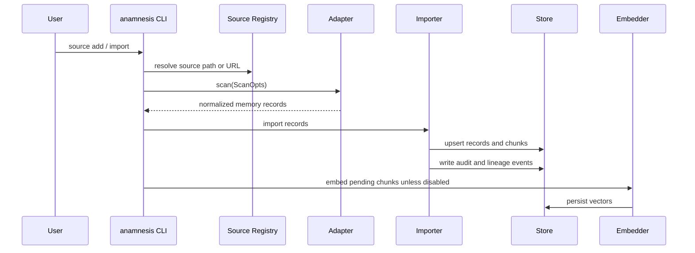
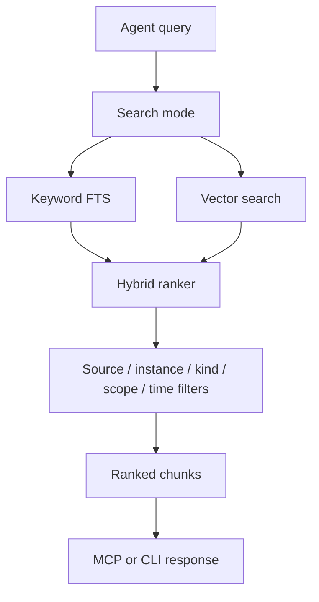
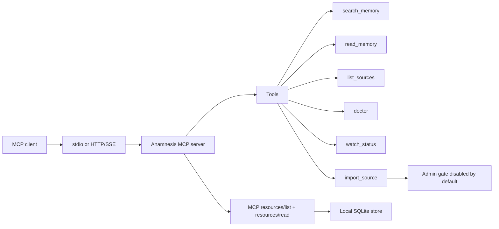
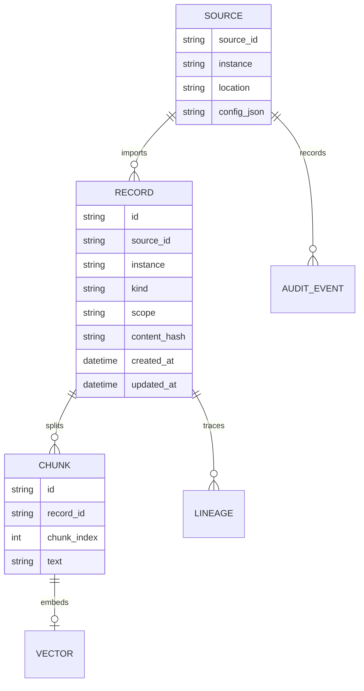

<p align="center">
  
</p>

# Anamnesis

**A local-first interoperability layer that imports, normalizes, indexes, and serves existing agent memory across tools.**

Anamnesis is not another memory product that asks users to start over. It is the bridge for memory that already exists in agent runtimes, SDKs, local caches, SQLite databases, JSON files, Markdown workspaces, and MCP resources.

<p align="center">
  
  
  = 1.85" />
  
  
  <br />
  <a href="https://x.com/Ghast_AI"></a>
  <a href="https://discord.gg/ghastai"></a>
</p>

<p align="center">
  <a href="#overview">Overview</a> ·
  <a href="#supported-sources">Supported Sources</a> ·
  <a href="#architecture">Architecture</a> ·
  <a href="#quick-start">Quick Start</a> ·
  <a href="#cli">CLI</a> ·
  <a href="./README.zh-CN.md">简体中文</a> ·
  <a href="./docs/BLUEPRINT.md">Blueprint</a> ·
  <a href="https://discord.gg/ghastai">Discord</a>
</p>

---

## Overview

Agent memory is fragmented. A user may have months of context in Codex, structured memories in mem0, sessions in Claude Code, and workspace notes in OpenClaw. These systems usually store memory in different formats and locations, so the context cannot move cleanly between agents.

Anamnesis solves that interoperability problem:

- **Import existing memory** from supported local stores and registered MCP resources.
- **Normalize records** into a shared schema with provenance, source identity, scope, timestamps, and content chunks.
- **Index locally** with SQLite FTS plus optional embeddings.
- **Serve memory back to agents** through CLI search, export, and MCP tools.
- **Keep ownership at the source**: the original agent or framework still creates the memory; Anamnesis aggregates and retrieves it.

This README describes the current source tree. “Supported” means an adapter crate and a CLI import path exist. It does not mean every upstream format has perfect semantic extraction yet. Precision varies by adapter, and the limitations section calls out the important gaps.

## Current Surface

| Area | Current implementation |
| --- | --- |
| Language | Rust workspace, MSRV `1.85` |
| Binaries | `anamnesis` CLI and `anamnesis-mcp` server |
| Storage | SQLite metadata, chunks, audit events, lineage, FTS search |
| Retrieval | Keyword, vector, and hybrid search with source, instance, kind, scope, and time filters |
| Embeddings | Local deterministic embeddings by default, provider-ready interface |
| Import | Shared importer service used by CLI and MCP admin import path |
| Auto-sync | `anamnesis watch` daemon keeps the store current — fs-watches local sources, polls URL sources, refreshes embeddings; optional auto-start at login (launchd/systemd) |
| MCP | stdio and HTTP/SSE transports; search, read, list, doctor, watch_status, and gated admin import tools |
| Extraction | Session extraction crate and CLI command with mock/OpenAI/Anthropic provider options |

## Supported Sources

`anamnesis discover` probes known local conventions for local adapters. `anamnesis source add ... --path ...` or `--url ...` is the authoritative way to register a source when the default detector is not appropriate.

### Agent Runtimes

| Source | Adapter ID | How it is registered | Current scanner reads | Precision |
| --- | --- | --- | --- | --- |
| Claude Code | `claude-code` | Local path, usually the Claude projects directory | Project/session files under the configured Claude Code root | Medium |
| Codex | `codex` | Local path, usually the Codex home directory | Memory files and rollout summaries available under the configured Codex root | Medium |
| Hermes | `hermes` | Local path | Hermes project and memory artifacts found by the adapter | Medium |
| OpenClaw | `openclaw` | Local path | `AGENTS.md`, `SOUL.md`, `TOOLS.md`, workspace skills, sessions | Medium-high |

### Memory Frameworks

| Source | Adapter ID | How it is registered | Current scanner reads | Precision |
| --- | --- | --- | --- | --- |
| mem0 | `mem0` | Local SQLite path | mem0 SQLite memory rows | High when the schema matches |
| Letta | `letta` | Local SQLite path | Letta archival/recall memory tables | High when the schema matches |
| TDAI | `tdai` | Local path | OpenClaw-compatible TDAI memory directories | Medium |
| OpenViking | `openviking` | Local path | AGFS-style local resources, agents, sessions | Medium |
| MemPalace | `mempalace` | Local path | Identity text and local palace/chroma SQLite data | Medium |
| Memori | `memori` | Local SQLite path | Memori SQLite rows | Medium-high when the schema matches |
| MemOS | `memos` | Local path | MemOS MemCube textual memory JSON | Medium |
| Memary | `memary` | Local path | Local Memary cache files | Medium |

### MCP Sources

| Source | Adapter ID | How it is registered | Current scanner reads | Precision |
| --- | --- | --- | --- | --- |
| Generic MCP server | `generic-mcp` | `source add generic-mcp --url <upstream-url> [--token-env ENV_NAME]` | `resources/list` and `resources/read` results from the upstream server | Depends on upstream metadata |

## Architecture

```mermaid
flowchart LR
    subgraph Sources["Existing memory producers"]
        A1["Agent runtimes"]
        A2["Memory frameworks"]
        A3["MCP resource servers"]
    end

    subgraph ImportLayer["Import layer"]
        B1["Detector"]
        B2["Adapter scanner"]
        B3["Normalizer"]
        B4["Dedup + provenance"]
    end

    subgraph Store["Local memory store"]
        C1["Records"]
        C2["Chunks"]
        C3["FTS index"]
        C4["Embeddings"]
        C5["Audit + lineage"]
    end

    subgraph Access["Agent access"]
        D1["CLI"]
        D2["MCP stdio"]
        D3["MCP HTTP/SSE"]
        D4["Export"]
    end

    Sources --> ImportLayer --> Store --> Access
```



## Import Pipeline



## Retrieval Flow



Search filters are pushed into the store API for keyword and vector search. Hybrid search combines ranked keyword and vector results and can be constrained to a source, instance, record kind, scope, and time range.

## MCP Runtime



The MCP server exposes read/search tools by default. Import is an admin operation and is hidden unless the server is started with admin tools enabled.

## Quick Start

Build from the current repository:

```bash
cargo build --workspace
cargo install --path crates/cli
cargo install --path crates/mcp-server
```

Initialize the local store:

```bash
anamnesis init
anamnesis status
```

Discover local sources:

```bash
anamnesis discover
```

Register an explicit local source:

```bash
anamnesis source add codex --path ~/.codex
```

Register an upstream MCP source:

```bash
anamnesis source add generic-mcp \
  --instance upstream \
  --url http://127.0.0.1:8787 \
  --token-env ANAMNESIS_UPSTREAM_TOKEN
```

Import and embed:

```bash
anamnesis import codex
anamnesis import generic-mcp:upstream
```

Keep it synced automatically (instead of re-running `import` by hand):

```bash
anamnesis watch            # foreground daemon: auto-import on change + poll URL sources
anamnesis watch install    # or auto-start at login (launchd on macOS, systemd on Linux)
anamnesis watch status     # is the daemon live, and how fresh is each source?
```

Search:

```bash
anamnesis search "project preferences" --source codex --limit 10
anamnesis search "long term profile" --mode hybrid --since 2026-01-01T00:00:00Z
```

Generate MCP client configuration:

```bash
anamnesis mcp config
anamnesis mcp config --transport sse --sse-port 7331
```

Run the server:

```bash
anamnesis serve
anamnesis serve --sse 7331
anamnesis-mcp --sse 7331
```

## Agent Plugins

Anamnesis ships a Claude Code marketplace plugin and Codex marketplace metadata in the same style as modern agent memory plugins: install the local binary first, add the marketplace, then let the client spawn Anamnesis through MCP.

### Claude Code

Add the marketplace:

```text
/plugin marketplace add Trapezohe/Anamnesis
```

Install the plugin:

```text
/plugin install anamnesis@anamnesis-plugins
```

For CLI installation with sparse checkout:

```bash
claude plugin marketplace add Trapezohe/Anamnesis --sparse .claude-plugin anamnesis-plugin
claude plugin install anamnesis@anamnesis-plugins
```

The plugin includes:

- MCP server config for `anamnesis serve`
- `anamnesis-memory` skill for deliberate memory recall
- `/anamnesis-status` and `/anamnesis-search` Claude Code commands
- no lifecycle hooks by default

### Codex

Fastest path, MCP only:

```bash
codex mcp add anamnesis -- anamnesis serve
```

Marketplace path:

```bash
codex plugin marketplace add Trapezohe/Anamnesis --sparse .agents/plugins anamnesis-plugin
```

Restart Codex, open the plugin UI, and install Anamnesis from the Anamnesis Plugins marketplace. Do not enable both direct MCP and marketplace plugin in the same profile unless duplicate MCP registrations are intentional.

## CLI

```text
anamnesis init
anamnesis status
anamnesis discover [--json] [--include-unregistered]
anamnesis source add <adapter> [--instance <name>] [--path <path>]
anamnesis source add generic-mcp [--instance <name>] --url <url> [--token-env <ENV_NAME>]
anamnesis source list [--json]
anamnesis import <source[:instance]> [--dry-run] [--no-embed] [--full] [--since <RFC3339>]
anamnesis watch [--no-embed]
anamnesis watch install | uninstall | status
anamnesis search <query> [--mode keyword|vector|hybrid] [--source <id>] [--instance <name>] [--kind <kind>] [--scope <scope>] [--since <RFC3339>] [--until <RFC3339>] [--json]
anamnesis extract <source[:instance]> [--provider mock|openai|anthropic] [--audit]
anamnesis lineage <record-id>
anamnesis audit
anamnesis export --format json|jsonl|markdown
anamnesis doctor [--json] [--include-unregistered]
anamnesis mcp config [--transport stdio|sse] [--sse-port <port>]
anamnesis serve
```

## Data Model



The store keeps provenance with each record so imported memory can be traced back to its source. Anamnesis should be able to answer “where did this memory come from?” before it answers “what did this memory say?”

## Session Extraction

The extractor turns conversation/session material into structured memory candidates. It is exposed through the `extract` command and supports mock, OpenAI, and Anthropic provider modes in the current source tree.

Extraction is intentionally separate from import:

- Import preserves source memory as faithfully as possible.
- Extraction derives higher-level memories from sessions.
- Audit and lineage commands make derived records reviewable.

## Project Layout

```text
crates/
  core/                  Shared memory schema and adapter traits
  store/                 SQLite store, FTS, vectors, audit, lineage
  importer/              Import service and normalization pipeline
  search/                Keyword, vector, and hybrid search
  embedder/              Embedding provider abstraction
  extractor/             Session-to-memory extraction
  cli/                   anamnesis CLI
  mcp-server/            MCP server
  adapter-*/             Source adapters
docs/
  blueprint/             Architecture and planning documents
packaging/               Packaging templates and scripts
```

## Current Limitations

- Adapter precision is not uniform. SQLite-backed systems are more precise when schemas match; file-based systems can be coarser.
- ghast AI is intentionally not supported as a memory source today. Its user memory database is encrypted, and prompts-only scanning is not enough to claim real memory import support.
- Generic MCP import depends on the upstream server exposing useful `resources/list` and `resources/read` metadata.
- Embedding storage and vector search are implemented locally, but production ANN tuning and sqlite-vec integration are separate follow-up work.
- Default discovery paths are conventions, not guarantees. Use `source add --path` or `source add --url` for reproducible imports.
- Release distribution status should be verified during each release. The repository supports source builds today.

## Roadmap

- Improve adapter-specific fidelity tests with realistic fixtures.
- Add stronger conformance checks for source registries and import previews.
- Extend MCP metadata conventions for upstream memory resources.
- Add production-grade vector index integration and ranking evaluation.
- Harden release packaging and published binary installation docs.
- Re-evaluate ghast AI only if an official export path or MCP resource surface makes user memories readable without decrypting private databases blindly.

## Community

- X: [@Ghast_AI](https://x.com/Ghast_AI)
- Discord: [discord.gg/ghastai](https://discord.gg/ghastai)

## License

Apache-2.0.

## Star History

<a href="https://www.star-history.com/#Trapezohe/Anamnesis&Date">
  <picture>
    <source media="(prefers-color-scheme: dark)" srcset="https://api.star-history.com/svg?repos=Trapezohe/Anamnesis&type=Date&theme=dark" />
    <source media="(prefers-color-scheme: light)" srcset="https://api.star-history.com/svg?repos=Trapezohe/Anamnesis&type=Date" />
    
  </picture>
</a>
