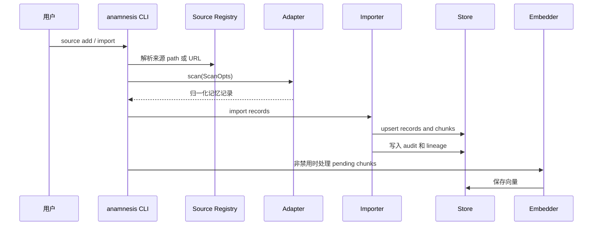
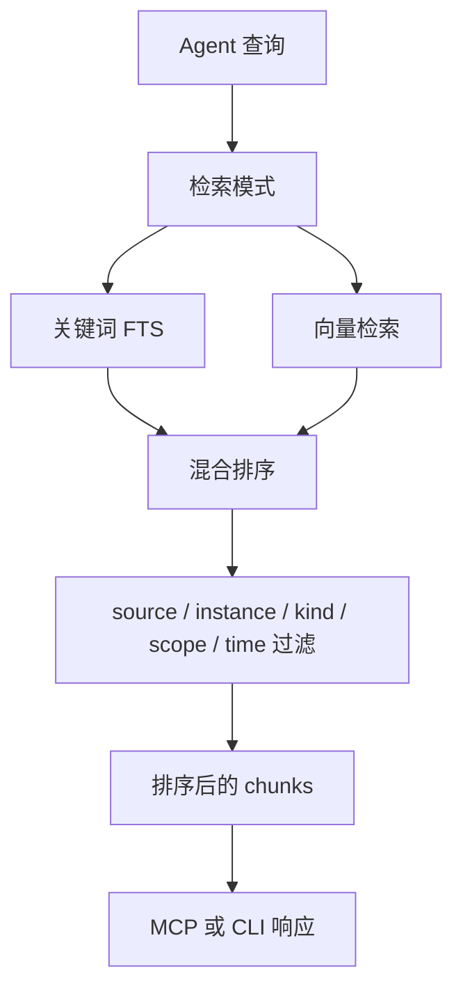
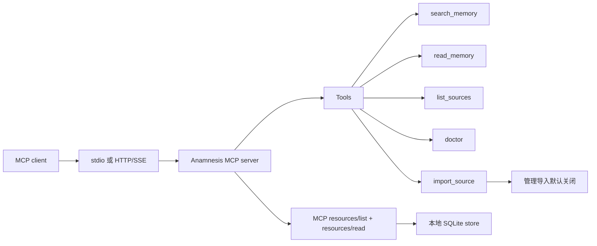
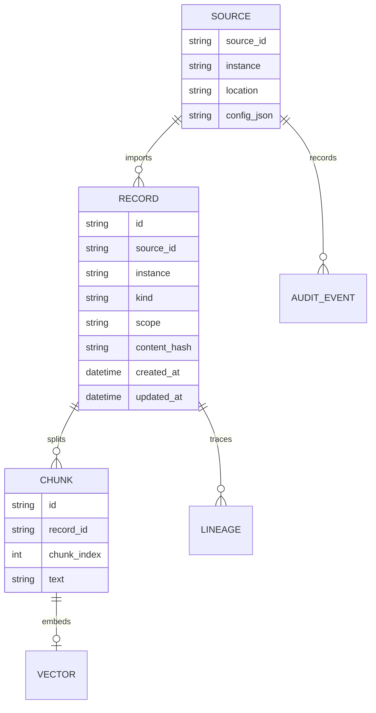

<p align="center">
  
</p>

# Anamnesis

**本地优先的跨 Agent 记忆互通层，用于导入、归一化、索引并服务已有记忆。**

Anamnesis 不是要求用户从零开始使用的新记忆系统。它要解决的是更现实的问题：用户已经在不同 Agent、SDK、记忆框架和本地工具里积累了大量记忆，但这些记忆分散在 SQLite、JSON、Markdown、目录缓存和 MCP 资源里，无法互通。

<p align="center">
  
  
  = 1.85" />
  
  
  <br />
  <a href="https://x.com/Ghast_AI"></a>
  <a href="https://discord.gg/ghastai"></a>
</p>

<p align="center">
  <a href="#项目概览">项目概览</a> ·
  <a href="#当前支持源">当前支持源</a> ·
  <a href="#系统架构">系统架构</a> ·
  <a href="#快速开始">快速开始</a> ·
  <a href="#cli">CLI</a> ·
  <a href="./README.md">English</a> ·
  <a href="./docs/BLUEPRINT.md">规划文档</a> ·
  <a href="https://discord.gg/ghastai">Discord</a>
</p>

---

## 项目概览

Agent 记忆现在是碎片化的。一个用户可能在 Codex 里有长期项目偏好，在 Claude Code 里有会话上下文，在 mem0 里有结构化记忆，在 OpenClaw 里有工作区资料。这些系统的存储方式不同，记忆很难被另一个 Agent 直接使用。

Anamnesis 的目标是做互通层：

- **导入已有记忆**：从本地记忆目录、SQLite 数据库、JSON/Markdown 文件和注册的 MCP 资源读取。
- **统一结构**：把不同来源归一化为带来源、实例、范围、时间、内容块和血缘信息的统一记录。
- **本地索引**：使用 SQLite FTS 和可选向量索引提供本地检索。
- **服务给 Agent**：通过 CLI、导出能力和 MCP 工具把记忆提供给其他 Agent。
- **不争夺记忆所有权**：原始 Agent 或记忆框架仍然负责产生记忆，Anamnesis 负责整理、归档和检索。

这份 README 只描述当前源码里已经存在的能力。“支持”表示存在适配器 crate 和 CLI 导入路径，不表示每个上游格式都已经做到完美语义解析。不同适配器的精度不同，重要限制写在后面的“当前限制”里。

## 当前能力面

| 模块 | 当前实现 |
| --- | --- |
| 语言 | Rust workspace，最低 Rust 版本 `1.85` |
| 二进制 | `anamnesis` CLI 和 `anamnesis-mcp` 服务端 |
| 存储 | SQLite 元数据、内容块、审计事件、血缘信息、FTS 检索 |
| 检索 | 关键词、向量、混合检索，支持 source、instance、kind、scope、时间过滤 |
| Embedding | 默认本地确定性 embedding，保留 provider 抽象 |
| 导入 | CLI 和 MCP 管理导入共用 importer service |
| MCP | stdio 和 HTTP/SSE 传输；搜索、读取、来源列表、诊断和受控导入工具 |
| 抽取 | session extractor crate 和 CLI 命令，支持 mock、OpenAI、Anthropic provider 模式 |

## 当前支持源

`anamnesis discover` 会探测常见本地约定目录。为了可复现，推荐使用 `anamnesis source add ... --path ...` 或 `--url ...` 显式注册来源。

### Agent Runtime

| 来源 | Adapter ID | 注册方式 | 当前读取内容 | 精度 |
| --- | --- | --- | --- | --- |
| Claude Code | `claude-code` | 本地路径，通常是 Claude projects 目录 | 配置根目录下的项目和会话文件 | 中 |
| Codex | `codex` | 本地路径，通常是 Codex home 目录 | 配置根目录下可用的 memory 文件和 rollout summary | 中 |
| Hermes | `hermes` | 本地路径 | Hermes adapter 能识别的项目和记忆文件 | 中 |
| OpenClaw | `openclaw` | 本地路径 | `AGENTS.md`、`SOUL.md`、`TOOLS.md`、workspace skills、sessions | 中高 |

### 记忆框架

| 来源 | Adapter ID | 注册方式 | 当前读取内容 | 精度 |
| --- | --- | --- | --- | --- |
| mem0 | `mem0` | 本地 SQLite 路径 | mem0 SQLite 记忆记录 | schema 匹配时高 |
| Letta | `letta` | 本地 SQLite 路径 | Letta archival/recall memory 表 | schema 匹配时高 |
| TDAI | `tdai` | 本地路径 | OpenClaw 兼容的 TDAI memory 目录 | 中 |
| OpenViking | `openviking` | 本地路径 | AGFS 风格本地 resources、agents、sessions | 中 |
| MemPalace | `mempalace` | 本地路径 | identity 文本和 palace/chroma SQLite 数据 | 中 |
| Memori | `memori` | 本地 SQLite 路径 | Memori SQLite 记录 | schema 匹配时中高 |
| MemOS | `memos` | 本地路径 | MemOS MemCube textual memory JSON | 中 |
| Memary | `memary` | 本地路径 | 本地 Memary cache 文件 | 中 |

### MCP 来源

| 来源 | Adapter ID | 注册方式 | 当前读取内容 | 精度 |
| --- | --- | --- | --- | --- |
| 通用 MCP server | `generic-mcp` | `source add generic-mcp --url <upstream-url> [--token-env ENV_NAME]` | 上游 server 暴露的 `resources/list` 和 `resources/read` | 取决于上游 metadata |

## 系统架构

```mermaid
flowchart LR
    subgraph Sources["已有记忆生产者"]
        A1["Agent runtime"]
        A2["记忆框架"]
        A3["MCP resource server"]
    end

    subgraph ImportLayer["导入层"]
        B1["Detector"]
        B2["Adapter scanner"]
        B3["Normalizer"]
        B4["去重 + 来源追踪"]
    end

    subgraph Store["本地记忆库"]
        C1["Records"]
        C2["Chunks"]
        C3["FTS index"]
        C4["Embeddings"]
        C5["Audit + lineage"]
    end

    subgraph Access["Agent 访问层"]
        D1["CLI"]
        D2["MCP stdio"]
        D3["MCP HTTP/SSE"]
        D4["Export"]
    end

    Sources --> ImportLayer --> Store --> Access
```



## 导入流程



## 检索流程



关键词和向量检索都支持在 store 层使用过滤条件。混合检索会合并关键词和向量结果，并可按来源、实例、记录类型、范围和时间区间约束。

## MCP 运行逻辑



MCP server 默认暴露读取和搜索能力。导入是管理操作，默认隐藏，只有启用 admin tools 后才可用。

## 快速开始

从当前仓库构建：

```bash
cargo build --workspace
cargo install --path crates/cli
cargo install --path crates/mcp-server
```

初始化本地存储：

```bash
anamnesis init
anamnesis status
```

发现本地来源：

```bash
anamnesis discover
```

显式注册本地来源：

```bash
anamnesis source add codex --path ~/.codex
```

注册上游 MCP 来源：

```bash
anamnesis source add generic-mcp \
  --instance upstream \
  --url http://127.0.0.1:8787 \
  --token-env ANAMNESIS_UPSTREAM_TOKEN
```

导入并生成索引：

```bash
anamnesis import codex
anamnesis import generic-mcp:upstream
```

检索：

```bash
anamnesis search "project preferences" --source codex --limit 10
anamnesis search "long term profile" --mode hybrid --since 2026-01-01T00:00:00Z
```

生成 MCP client 配置：

```bash
anamnesis mcp config
anamnesis mcp config --transport sse --sse-port 7331
```

启动服务：

```bash
anamnesis serve
anamnesis serve --sse 7331
anamnesis-mcp --sse 7331
```

## Agent 插件

Anamnesis 现在提供 Claude Code marketplace plugin 和 Codex marketplace metadata。安装方式参考成熟 memory plugin 的路径：先安装本地 `anamnesis` 二进制，再添加 marketplace，让客户端通过 MCP 启动 Anamnesis。

### Claude Code

添加 marketplace：

```text
/plugin marketplace add Trapezohe/Anamnesis
```

安装插件：

```text
/plugin install anamnesis@anamnesis-plugins
```

CLI sparse 安装：

```bash
claude plugin marketplace add Trapezohe/Anamnesis --sparse .claude-plugin anamnesis-plugin
claude plugin install anamnesis@anamnesis-plugins
```

插件包含：

- `anamnesis serve` 的 MCP server 配置
- `anamnesis-memory` skill，用于指导 Agent 有意识地检索已有记忆
- `/anamnesis-status` 和 `/anamnesis-search` Claude Code 命令
- 默认不启用 lifecycle hooks

### Codex

最快路径，只接 MCP：

```bash
codex mcp add anamnesis -- anamnesis serve
```

Marketplace 路径：

```bash
codex plugin marketplace add Trapezohe/Anamnesis --sparse .agents/plugins anamnesis-plugin
```

重启 Codex，打开插件 UI，从 Anamnesis Plugins marketplace 安装 Anamnesis。不要在同一个 profile 里同时启用 direct MCP 和 marketplace plugin，除非你明确想要重复注册 MCP。

## CLI

```text
anamnesis init
anamnesis status
anamnesis discover [--json] [--include-unregistered]
anamnesis source add <adapter> [--instance <name>] [--path <path>]
anamnesis source add generic-mcp [--instance <name>] --url <url> [--token-env <ENV_NAME>]
anamnesis source list [--json]
anamnesis import <source[:instance]> [--dry-run] [--no-embed] [--full] [--since <RFC3339>]
anamnesis search <query> [--mode keyword|vector|hybrid] [--source <id>] [--instance <name>] [--kind <kind>] [--scope <scope>] [--since <RFC3339>] [--until <RFC3339>] [--json]
anamnesis extract <source[:instance]> [--provider mock|openai|anthropic] [--audit]
anamnesis lineage <record-id>
anamnesis audit
anamnesis export --format json|jsonl|markdown
anamnesis doctor [--json] [--include-unregistered]
anamnesis mcp config [--transport stdio|sse] [--sse-port <port>]
anamnesis serve
```

## 数据模型



每条记录都会保留来源信息。Anamnesis 需要先能回答“这条记忆从哪里来”，再回答“这条记忆说了什么”。

## Session 抽取

Extractor 会把会话材料转换成结构化记忆候选。目前源码中已经有 `extract` 命令，并支持 mock、OpenAI、Anthropic provider 模式。

抽取和导入是分开的：

- 导入尽量保留原始来源记忆。
- 抽取从会话中派生更高层记忆。
- 审计和血缘命令用于让派生记录可追踪、可审查。

## 项目结构

```text
crates/
  core/                  共享记忆 schema 和 adapter trait
  store/                 SQLite store、FTS、vector、audit、lineage
  importer/              导入服务和归一化流程
  search/                关键词、向量、混合检索
  embedder/              Embedding provider 抽象
  extractor/             Session 到记忆的抽取
  cli/                   anamnesis CLI
  mcp-server/            MCP server
  adapter-*/             来源适配器
docs/
  blueprint/             架构和规划文档
packaging/               打包模板和脚本
```

## 当前限制

- 不同适配器的精度不一致。SQLite 系统在 schema 匹配时更精确，文件型系统可能更粗粒度。
- ghast AI 当前明确不作为记忆来源支持。它的用户记忆数据库是加密的，只扫描 prompts 不能代表真正的记忆导入能力。
- 通用 MCP 导入依赖上游 server 暴露有用的 `resources/list` 和 `resources/read` metadata。
- 本地 embedding 存储和向量检索已经存在，但生产级 ANN 调优和 sqlite-vec 集成仍是后续工作。
- 默认 discover 路径只是约定，不是保证。需要可复现导入时请使用 `source add --path` 或 `source add --url`。
- 发布分发状态需要在每次 release 时核验。当前仓库支持从源码构建。

## 路线图

- 为各适配器补充更真实的 fixture 和一致性测试。
- 强化 source registry 与 import preview 的约束检查。
- 扩展 MCP 上游记忆资源的 metadata 约定。
- 接入生产级向量索引和排序评估。
- 完善 release packaging 和二进制安装文档。
- 只有当 ghast AI 提供正式 export 或 MCP resource surface，并且不需要盲目解密私有数据库时，才重新评估是否接入。

## 社区

- X: [@Ghast_AI](https://x.com/Ghast_AI)
- Discord: [discord.gg/ghastai](https://discord.gg/ghastai)

## License

Apache-2.0.

## Star History

<a href="https://www.star-history.com/#Trapezohe/Anamnesis&Date">
  <picture>
    <source media="(prefers-color-scheme: dark)" srcset="https://api.star-history.com/svg?repos=Trapezohe/Anamnesis&type=Date&theme=dark" />
    <source media="(prefers-color-scheme: light)" srcset="https://api.star-history.com/svg?repos=Trapezohe/Anamnesis&type=Date" />
    
  </picture>
</a>
