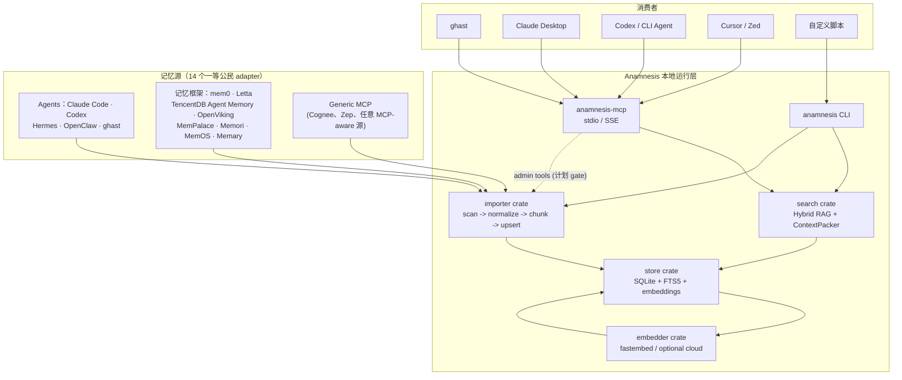
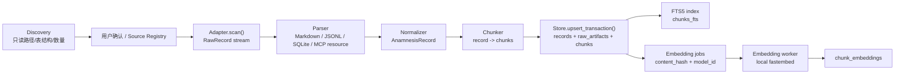
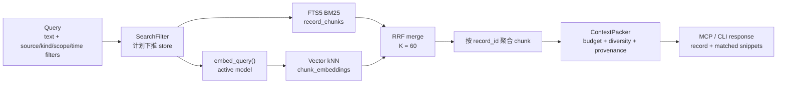
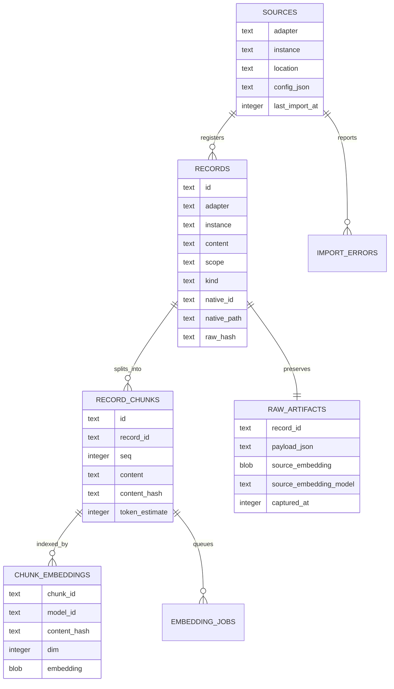
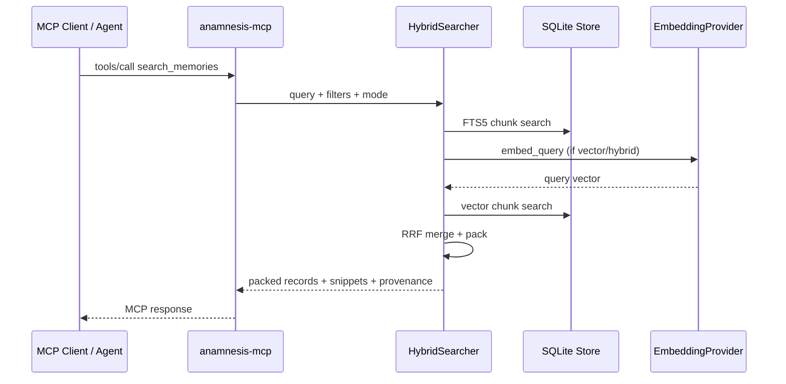

<p align="center">
  
</p>

<h1 align="center">Anamnesis · 搜魂术</h1>

<p align="center">
  <strong>把散落在各家 Agent 里的记忆，引渡到一个统一、可审计、本地优先的记忆层。</strong>
</p>

<p align="center">
  <a href="https://github.com/Trapezohe/Anamnesis/releases/tag/v0.1.0"></a>
  <a href="https://crates.io/crates/anamnesis-cli"></a>
  <a href="./LICENSE"></a>
  
  
  
  <a href="https://x.com/Ghast_AI"></a>
  <a href="https://discord.gg/ghastai"></a>
</p>

<p align="center">
  <a href="./README.md">English</a>
  · <a href="#概览">概览</a>
  · <a href="#当前支持的记忆框架与-agent">当前支持</a>
  · <a href="#系统架构">系统架构</a>
  · <a href="#快速开始">快速开始</a>
  · <a href="./docs/BLUEPRINT.md">蓝图</a>
  · <a href="https://discord.gg/ghastai">Discord</a>
</p>

---

## 30 秒上手

```bash
cargo install --locked anamnesis-cli anamnesis-mcp-server
```

```bash
# 1. 初始化本地 store
anamnesis init

# 2. 注册一个你已经在用的源 —— 比如 Claude Code
anamnesis source add claude-code --path ~/.claude/projects

# 3. 导入 + 建索引（在真实 ~/.claude/projects 上：1795 records / 50K chunks）
anamnesis import claude-code

# 4. 跨所有已导入的源做检索
anamnesis search "用户喜欢用什么方式写测试？"

# 5. 把 Anamnesis 接到 Claude Desktop / Cursor / ghast 作为 MCP server
anamnesis mcp config > ~/Library/Application\ Support/Claude/claude_desktop_config.json
```

其它安装路径（一行 curl、Homebrew、源码、二进制 tarball）见 [快速开始](#快速开始)；14 个一等 adapter + generic MCP 见 [当前支持的记忆框架与 Agent](#当前支持的记忆框架与-agent)。

---

## 概览

**Anamnesis（搜魂术）** 是一个开源、本地优先的跨 Agent 记忆层。它通过 **14 个一等 adapter** 读取数据 —— Agent 框架（Claude Code、Codex、Hermes、OpenClaw、ghast）与记忆系统（mem0、Letta、TencentDB Agent Memory、OpenViking、MemPalace、Memori、MemOS、Memary） —— 加上 Generic MCP adapter 兜底任意 MCP-aware 项目，把它们归一化到同一套 schema、SQLite 存储和 Anamnesis 自有 RAG 索引中，再通过 CLI 与 MCP 提供给任何可信 Agent 使用。**两阶段 session extractor** 把原始 `Episode` 记忆蒸馏成持久的 `Fact` / `Preference` / `Feedback` / `Skill`，每次 LLM 调用都可审计、有显式 gating、并通过 provenance 链回源 Episode。

它不是另一个聊天应用，而是 Agent 时代的本地记忆基础设施：

- **用户主权**：记忆默认留在本地，不默认上传、不默认遥测。
- **跨工具连续性**：一个 Agent 学到的用户偏好、项目规则和历史上下文，可以被其他可信 Agent 继续使用。
- **统一检索栈**：不代理 mem0 search，不混用 Claude / Codex / Hermes 的向量空间；统一由 Anamnesis chunk、embedding、FTS、vector search、rerank。
- **可审计 provenance**：每条记录都保留 `adapter / instance / native_id / native_path / raw_hash`，可以回到原始来源。

> 当前状态：`v0.1.0` — 首个稳定的 adapter-contract release。14 个一等 adapter 全部通过共享 `MemoryAdapter` 不变量验证；CLI、MCP server、搜索、以及 Claude Desktop / Cursor / ghast 接入（`anamnesis mcp config`）均已稳定。schema 与 `MemoryAdapter` trait 进入 0.1.x 稳定线，遵循 semver。

## 技术概览

| 维度 | 当前实现 |
|---|---|
| 语言 | Rust 2021，MSRV `1.85` |
| 二进制 | `anamnesis` CLI、`anamnesis-mcp` MCP server |
| 存储 | SQLite + FTS5 + chunk-level tables；当前向量为 BLOB-backed cosine fallback，sqlite-vec 是目标替换层 |
| 检索 | FTS5 BM25 + vector kNN + Reciprocal Rank Fusion + ContextPacker |
| Embedding | 默认本地 `fastembed-rs`；内置 curated model registry；Voyage cloud provider 必须显式开启 |
| 协议 | MCP stdio；`anamnesis-mcp --sse` 支持 loopback HTTP/SSE |
| 当前 Adapter | 14 个一等公民：Claude Code、Codex、mem0、Letta、Hermes、OpenClaw、ghast、TencentDB Agent Memory、OpenViking、MemPalace、Memori、MemOS、Memary、Generic MCP |
| Session 抽取器 | §-1.5 PR-6 两阶段（确定性 gate + LLM）。三个 provider：`mock`（离线、确定性）、`openai`（任意 Chat-Completions 兼容：OpenAI、Ollama、vLLM、OpenRouter …）、`anthropic`（原生 Messages API）。每次运行写一行到 `<data_dir>/audit/stage2.jsonl`；`anamnesis lineage <id>` 走 `provenance.derived_from`。 |
| 安全姿态 | 本地优先、source provenance、cloud provider 显式 opt-in；MCP admin tool gate 是下一轮 P0 收口项 |

## 当前支持的记忆框架与 Agent

### 可导入的记忆源

#### §-2.2 Agents

| Source / Agent | 状态 | 当前读取内容 | 精准度 |
|---|---|---|---|
| Claude Code | 可用 | `~/.claude/projects/*/memory/*.md`、项目 `*.jsonl` session | memory md 中高；session 中低 |
| Codex | 可用 | `~/.codex/` 下 session JSON / JSONL | 中 |
| Hermes (Nous Research) | 可用 | `~/.hermes/MEMORY.md` + `USER.md` + SQLite session DB | 中高 |
| OpenClaw | 可用 | `~/.openclaw/` workspace MD + `skills/`、`sessions/*.json[l]` | 中高 |
| ghast | 可用 | `~/Documents/ghast_desktop/prompts/`、bundled skills；检测加密 profile DB | 中高 |

#### §-2.3 记忆框架

| Source / Framework | 状态 | 当前读取内容 | License |
|---|---|---|---|
| mem0 | 可用 | self-hosted SQLite `memories` 表 | Apache-2.0 |
| Letta (前 MemGPT) | 可用 | SQLite `block` 表 (`~/.letta/letta.db`) | Apache-2.0 |
| TencentDB Agent Memory | 可用 | `~/.openclaw/memory-tdai/` 4 层（L0 refs / L1 JSONL facts / L2 scenarios / L3 persona）| MIT |
| OpenViking | 可用 | VikingFS AGFS workspace（resources/user/agent/session × L0/L1/L2）| AGPLv3（只读，不链接代码）|
| MemPalace | 可用 | `~/.mempalace/identity.txt` + ChromaDB drawers/closets | AGPLv3（只读，不链接代码）|
| Memori | 可用 | SQLite —— entity_facts、process_attrs、conversation messages + summaries、KG triples | Apache-2.0 |
| MemOS | 可用 | MemCube dump (`textual_memory.json`)，按 `memory_type` 分类 | Apache-2.0 |
| Memary | 可用 | 本地 cache 文件（`memory_stream.json`、entity tally、past chat、personas）| MIT |

#### §-2.4 长尾（任意 MCP-aware 源）

| 协议 | 状态 | 当前读取内容 |
|---|---|---|
| Generic MCP Server | 可用 | `resources/list` + `resources/read` —— 适用于任何暴露 MCP server 的项目（Cognee、Zep 等）|

### 可消费 Anamnesis 的工具

| Consumer | 接入方式 | 状态 | 说明 |
|---|---|---|---|
| ghast | MCP server config | 计划集成 | ghast 是第一消费者，但 Anamnesis 保持独立开源项目 |
| Claude Desktop / Claude Code MCP client | `anamnesis-mcp` stdio | 可接入 | 适合本地检索和 provenance 查询 |
| Codex / CLI Agent | MCP stdio 或 CLI | 可接入 | 可以通过 MCP 或 shell 命令消费 |
| Cursor / Zed / 其他 MCP-aware tools | MCP stdio / SSE | 可接入 | 取决于各客户端 MCP 能力 |
| 自定义脚本 | CLI + JSON 输出 | 可接入 | `search --json`、`export`、`status --json` |

### 计划支持

| Source / Consumer | 类型 | 计划 |
|---|---|---|
| Zep / Graphiti | 时序知识图 | 双时序 fact 突破当前 `created_at/updated_at` schema；§-1.4 schema 演进前先通过 `generic-mcp` 消费 |
| Cognee | DuckDB + Kuzu graph | 当前通过 Cognee 自带 MCP server + `generic-mcp` 消费；待官方落地可移植本地导出后再做 native adapter |
| LangMem | LangChain SDK | 实际读取 backend 跟随 LangGraph Store；case-by-case |
| OpenAI / Voyage / 其他云 embedding | Embedding provider | 只做显式 opt-in，永不默认外发 |
| Session extractor (§-1.5 PR-6) | 流水线 | 两阶段 LLM-gated `Episode → Fact / Preference / Skill / Feedback` 蒸馏 |
| Agent Memory Interchange Format | 标准化方向 | 后续 RFC，推动跨 Agent 记忆交换 |

## 为什么需要 Anamnesis

今天每个 Agent 和记忆框架都在各自保存"记忆"：

- **Agents** —— Claude Code 有项目 JSONL session 和 markdown memory；Codex 有本地 session 和 rollout 历史；Hermes 用 SQLite session DB 加 `MEMORY.md`/`USER.md`；OpenClaw 和 ghast 各自维护一套 workspace 约定。
- **记忆框架** —— mem0、Letta、Memori 用 SQLite；MemPalace 用 ChromaDB；OpenViking 和 TencentDB Agent Memory 用分层目录；MemOS dump 成 JSON MemCube；Memary 用 Neo4j + 本地 cache JSON；Cognee 用 DuckDB+Kuzu；Zep/Graphiti 用时序图。

如果这些记忆只待在原系统里，用户每换一个工具或框架就要重新训练一次 Agent —— 而从一个记忆框架迁移到另一个就意味着丢掉积累多年的上下文。Anamnesis 做的是把这些分散资产统一成一个本地、开放、可检索、可迁移的记忆层 —— 对每个上游都是只读，保留完整 provenance，原始来源始终是权威。

## 系统架构



## 导入运行逻辑

Anamnesis 把“读取载体”和“理解记忆语义”拆开。Adapter 不直接写数据库，只负责发现、读取和规范化；所有持久化统一由 store transaction 完成。



### Adapter 精准度矩阵

| Source | 当前读取方式 | 统一结果 | 精准度 | 说明 |
|---|---|---|---|---|
| Claude Code memory markdown | `~/.claude/projects/*/memory/*.md` | frontmatter type -> `Kind/Scope`，body -> `content` | 中高 | 结构化 memory 已可用；frontmatter parser 仍需增强 |
| Claude Code JSONL | 项目 `*.jsonl` 文件 | `Episode / Session` | 中低 | 当前是历史对话召回，不等于稳定偏好抽取 |
| mem0 SQLite | read-only `memories` 表 | `memory` -> content，默认 `Fact / User` | 中高 | SQLite 模式可用；API 模式和 source embedding provenance 待补 |
| Codex | 基础 `.json/.jsonl` 扫描 | `Episode / Session` | 低 | 需要识别真实 Codex session schema 和路径白名单 |
| Generic MCP | `resources/list` + `resources/read` | `Unknown / Ephemeral` | 低 | 适合 opaque resource；精准语义需定义 memory MCP 约定 |

## RAG 检索运行逻辑

Anamnesis 的检索路径完全由自己控制。源系统的向量、搜索 API 或排序逻辑不会进入统一检索结果。



检索原则：

- **source embedding 只作 provenance**：源系统自带向量只能存到 `raw_artifacts`，永远不参与跨源搜索。
- **index embedding 统一生成**：所有 chunk 使用 Anamnesis 当前 active model 重新 embedding。
- **chunk 是检索单元，record 是语义单元**：长 session 可切多个 chunk，但对外聚合回 record。
- **ContextPacker 控制最终上下文**：预算、provenance、source diversity、matched snippets 都在返回给 Agent 前处理。

## 存储模型



## MCP 运行逻辑



当前 MCP 能力：

| 类型 | 能力 |
|---|---|
| Tools | `search_memories`、`get_record`、`list_sources`、`import_source`、`trace_provenance` |
| Resources | `anamnesis://record/{id}`、`anamnesis://source/{adapter}`、`anamnesis://timeline/{date}` |
| Prompts | `summarize_my_preferences`、`find_related` |

> 安全说明：`import_source` 属于 admin 能力。pre-release 阶段只建议在可信本地 client 中使用；下一轮 P0 会默认关闭 MCP admin tools。

## 快速开始

### 从 crates.io 安装（推荐）

v0.1.0 起 22 个 workspace crate 全部发布到 crates.io：

```bash
cargo install --locked anamnesis-cli anamnesis-mcp-server
```

要求 Rust `>= 1.85`。本地编译，所以任何有 Rust 工具链的目标都能装 —— Linux x86_64/aarch64、macOS x86_64/arm64、Windows 都覆盖。

### 一行 curl（不想装 Rust 工具链的）

```bash
curl -fsSL https://raw.githubusercontent.com/Trapezohe/Anamnesis/main/install.sh | sh
```

会自动识别平台、下对应的 release tarball、校验 SHA-256、把 `anamnesis` + `anamnesis-mcp` 安装到 `~/.local/bin`。预编译 tarball 平台：Linux x86_64、macOS x86_64/aarch64。Linux aarch64 暂时只能走 `cargo install`（fastembed C deps cross-compile 问题）。Windows 用户从 [Releases 页](https://github.com/Trapezohe/Anamnesis/releases) 抓 `.zip`。

### 从源码安装

```bash
git clone https://github.com/Trapezohe/Anamnesis
cd Anamnesis

cargo install --path crates/cli
cargo install --path crates/mcp-server
```

### 初始化与导入

```bash
anamnesis init
anamnesis discover
anamnesis source add claude-code --path ~/.claude/projects
anamnesis import claude-code
anamnesis search "用户偏好怎么写测试？"
anamnesis status
```

### 作为 MCP server 使用

```bash
anamnesis-mcp
anamnesis-mcp --sse 8787
```

MCP client 配置示例：

```json
{
  "mcpServers": {
    "anamnesis": {
      "command": "anamnesis-mcp",
      "args": []
    }
  }
}
```

## CLI 一览

```bash
anamnesis init [--model KEY]
anamnesis discover
anamnesis source add/list/remove
anamnesis import <adapter>[:instance] [--full] [--dry-run] [--no-embed] [--path PATH]
anamnesis search <query> [--source X] [--kind K] [--scope S] [--limit N] [--mode hybrid|fulltext|vector] [--json]
anamnesis export [--format jsonl|csv] [--out FILE] [--source X]
anamnesis verify [--repair]
anamnesis model list/use/install/rebuild
anamnesis serve
anamnesis migrate
```

## 当前限制

Anamnesis 已经具备统一入库和统一检索闭环，但还不能宣称“精准理解所有 Agent 的记忆语义”。

- Codex adapter 仍是基础 episode 导入。
- Generic MCP adapter 仍是 opaque resource 导入。
- `source add` 与 `import` 的 canonical registry 链路需要继续收口。
- `--full / --since` 与 `ScanOpts` 需要真正接入 adapter scan。
- MCP admin tools 需要默认关闭。
- Session 到 stable memory 的二阶段 extractor 仍在设计中。

## 路线图

| 阶段 | 状态 | 重点 |
|---|---|---|
| Phase 0 | 完成 | Rust workspace、Apache-2.0、CI（8-leg 矩阵）、README/CONTRIBUTING、schema v1/v2 |
| Phase 1 | 完成 | core/store/importer/search/embedder、§-2.2 + §-2.3 共 14 个一等 adapter、本地 hybrid RAG、§-1.5 PR-6 两阶段 session extractor（Mock + OpenAI + Anthropic provider、audit log、lineage CLI） |
| Phase 2 | 收口中 | MCP admin gate、source registry import、filter 下推、ScanOpts、streaming scan |
| Phase 3 | 进行中 | crates.io 发布 ✓（v0.1.0，22 crate）、ghast 首消费者集成、真实 dogfood 质量评估、Homebrew tap |
| Phase 4 | 计划中 | Memory MCP convention、Agent Memory Interchange Format、时序图 schema 演进（解锁 Zep / Cognee Kuzu 原生 adapter） |

## 贡献

最有价值的贡献是新增高质量 adapter。每个 adapter 应遵守：

- discovery 只读 metadata；
- scan 流式产出 raw records；
- normalize 是确定性纯函数；
- 每条记录保留 provenance；
- 通过 shared adapter contract tests。

详见 [CONTRIBUTING.md](./CONTRIBUTING.md)。

## 社区

- X: [@Ghast_AI](https://x.com/Ghast_AI)
- Discord: [discord.gg/ghastai](https://discord.gg/ghastai)

## License

[Apache License 2.0](./LICENSE)

用户导入的记忆数据不属于本项目 license 范围，始终属于用户自己。

## Star History

<a href="https://www.star-history.com/#Trapezohe/Anamnesis&Date">
  <picture>
    <source media="(prefers-color-scheme: dark)" srcset="https://api.star-history.com/svg?repos=Trapezohe/Anamnesis&type=Date&theme=dark" />
    <source media="(prefers-color-scheme: light)" srcset="https://api.star-history.com/svg?repos=Trapezohe/Anamnesis&type=Date" />
    
  </picture>
</a>
